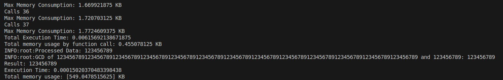
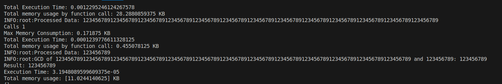
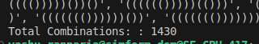
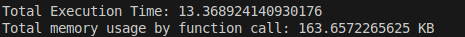
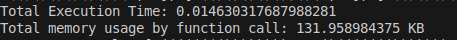
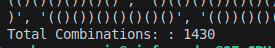
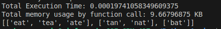
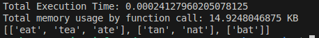

# Python_Assign

## Problem - 1: [Problem1.py](problem_1.py)
-   To calculate GCD: Used Euclid's Algo
    -   Time complexity: O(log(n))
-   To transform data from words to corresponding numbers: 
    -   Approach 1: Recursion
        -   Time Complexity: O(n)
        -   Space complexity: O(1) + O(n)   <-   Auxilary space for dictonary of words which is constant and n recursive call stored in stack.
        -   Output:
            
    -   Approach 2: With While Loop
        -   Time Complexity: O(n)
        -   Space complexity: O(1)  <-  Only constant space for dictonary of words and other variable used.
        -   Output:
            

## Problem - 2: [Problem2.py](problem_2.py)
-   To find all possible valid combinations of (): Need to travers over whole tree and will get the resultant combination at leaf nodes.
    -   Time Complexity: O(2^n)
    -   Appraoch 1: Recursion
        -   Output:
            
            

    -   Appraoch 2: Loop
        -   Output:
            
            

## Problem - 3: [Problem3.py](problem_3.py)
-   To group anagrams: Using dictonary to fast access and append in value
    -   Approach 1: Prior sorting of all strings:
        -   Time Complexity: O(n * m) + O(n * mlogm)    =>  O(n * mlogm)
        -   Output:
            

    -   Approach 2: Using counters
        -   Time Complexity: O(n * m) + O(n * mlogm)
        -   Output:
            